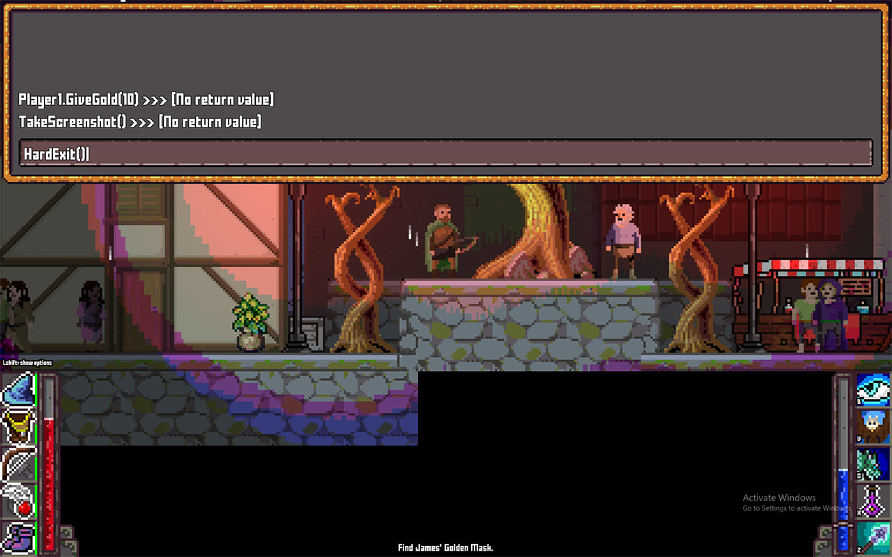

# Debug Console



**prerequisite**: you must have NuGet package `Microsoft.CodeAnalysis.CSharp.Scripting` installed.

The following code snippet creates an in-game debug console where you can execute commands at runtime:

```cs
using System;
using System.Collections.Generic;
using BonEngineSharp;
using BonEngineSharp.Defs;
using BonEngineSharp.Framework;
using BonEngineSharp.UI;
using Microsoft.CodeAnalysis.CSharp.Scripting;

/// <summary>
/// Debug console to execute commands at runtime.
/// </summary>
public class DebugConsole
{
    /// <summary>
    /// Is debug console currently visible?
    /// </summary>
    public bool Visible { get; private set; }

    // globals object
    object _globals;

    // main console window
    UIWindow _window;
    UIElement _outputContainer;
    UITextInput _input;

    // ui root folder
    string _UIroot;

    // list of output lines
    struct OutputLine
    {
        public string Line;
        public bool IsError;
    }
    List<OutputLine> _outputData = new List<OutputLine>();
    bool _outputDirty = true;

    /// <summary>
    /// Init the debug console.
    /// </summary>
    /// <param name="globals">Object to use as globals (every public member of this object will be accessible to script). Can be null.</param>
    /// <param name="UIroot">UI root folder to read ini files from.</param>
    /// <param name="height">Console height, in pixels.</param>
    public void Initialize(object globals, string UIroot = "Game/UI/", int height = 400)
    {
        // store ui root
        if (!UIroot.EndsWith('/')) { UIroot += '/'; }
        _UIroot = UIroot;

        // store globals
        _globals = globals;

        // create window
        var ui = BonEngine._Engine.UI;
        _window = ui.CreateWindow(UIroot + "window.ini", null, "");
        _window.WidthPercents = 100;
        _window.HeightPixels = height;
        _window.AutoArrangeChildren = false;

        // add command input
        _input = ui.CreateTextInput(UIroot + "textinput.ini", _window);
        _input.Anchor = new PointF(0, 1);
        _input.Origin = new PointF(0, 1);
    }

    /// <summary>
    /// Execute a single command.
    /// </summary>
    public void Execute(string command)
    {
        // skip empty
        if (command.Length == 0) { return; }

        // command for output
        var commandForOutput = (command.Length > 24 ? command.Substring(0, 24) : command) + " >>> ";

        // try to execute
        try
        {
            if (!command.EndsWith(';')) { command += ';'; }
            var result = CSharpScript.EvaluateAsync(command, null, _globals).Result;
            if (result != null)
            {
                PrintCommandResult(commandForOutput + result.ToString());
            }
            else
            {
                PrintCommandResult(commandForOutput + "[No return value]");
            }
        }
        // handle errors
        catch (Exception e)
        {
            PrintError(commandForOutput + e.Message);
        }
    }

    /// <summary>
    /// Print last command's result.
    /// </summary>
    private void PrintCommandResult(string result)
    {
        _outputData.Insert(0, new OutputLine() { Line = result, IsError = false });
        _outputDirty = true;
    }

    /// <summary>
    /// Print error message.
    /// </summary>
    private void PrintError(string result)
    {
        _outputData.Insert(0, new OutputLine() { Line = result, IsError = true });
        _outputDirty = true;
    }

    /// <summary>
    /// Show the debug console.
    /// </summary>
    public void Show()
    {
        Visible = true;
    }

    /// <summary>
    /// Hide the debug console.
    /// </summary>
    public void Hide()
    {
        Visible = false;
    }

    /// <summary>
    /// Toggle console visibility.
    /// </summary>
    public void Toggle()
    {
        Visible = !Visible;
    }

    /// <summary>
    /// Update the debug console.
    /// </summary>
    public void Update(double deltaTime)
    {
        // update UI
        if (!Visible) { return; }
        BonEngine._Engine.UI.UpdateUI(_window);

        // make sure input line is focused
        _input.IsReceivingInput = true;

        // on enter, send command
        var input = BonEngine._Engine.Input;
        if (input.ReleasedNow(KeyCodes.KeyKpEnter) || input.ReleasedNow(KeyCodes.KeyReturn) || input.ReleasedNow(KeyCodes.KeyReturn2))
        {
            Execute(_input.Value);
            _input.Value = "";
        }

        // update output window
        if (_outputDirty)
        {
            // remove previous output window
            if (_outputContainer != null) 
            {
                _window.RemoveChild(_outputContainer);
            }

            // recreate output window
            _outputContainer = BonEngine._Engine.UI.CreateContainer(null, _window);
            _outputContainer.WidthPercents = 100;
            _outputContainer.HeightPixels = _window.CalculatedDestRect.Height - (_input.CalculatedDestRect.Height + 6);
            _outputContainer.AutoArrangeChildren = false;

            // add output
            int index = 0;
            foreach (var output in _outputData)
            {
                var para = BonEngine._Engine.UI.CreateText(_UIroot + "small_text.ini", _outputContainer, output.Line);
                if (output.IsError) { para.Color = Color.Red; }
                para.Origin = new PointF(0, 1);
                para.Anchor = new PointF(0, 1);
                para.Offset = new PointI(0, -(int)(index * para.CalculatedDestRect.Height * 0.75f) - _input.CalculatedDestRect.Height);
                index++;
                if (index * para.CalculatedDestRect.Height > _outputContainer.HeightPixels - _window.Padding.Top) { break; }
            }
            if (index < _outputData.Count)
            {
                _outputData.RemoveRange(index, _outputData.Count - index);
            }

            // no longer need update
            _outputDirty = false;
        }
    }

    /// <summary>
    /// Draw the debug console.
    /// </summary>
    public void Draw()
    {
        if (!Visible) { return; }
        BonEngineSharp.BonEngine._Engine.UI.Draw(_window, false);
    }
}
```


## Usage

To use the snippet above, you need to make 3 calls:

### Initialize

Call this to create the debug console (note: it won't be visible until you call 'Show' or 'Toggle'):

```cs
_debugConsole = new DebugConsole();
_debugConsole.Initialize(globalObject, uiRootFolder);
```

- **globalObject** is an object to set as the global scope, all its public members will be accessible when executing commands.
- **uiRootFolder** is the path of the folder where you keep your UI ini files at. You must have at least the following stylesheets: window.ini, textinput.ini, and small_text.ini.

Note: if you don't know how to create UI files, just copy the whole ui folder for the demo projects assets in the [project repo](https://github.com/RonenNess/BonEngineSharp/tree/master/BonEngineSharpTest/TestAssets/ui).

### Update

Update the console + toggle it with F1 key:

```cs
_debugConsole.Update(deltaTime);

if (Input.ReleasedNow(KeyCodes.KeyF1))
{
    _debugConsole.Toggle();
}
```

### Draw 

Render the console (will only show it if you called 'Toggle' or 'Show' before):

```cs
_debugConsole.Draw();
```

