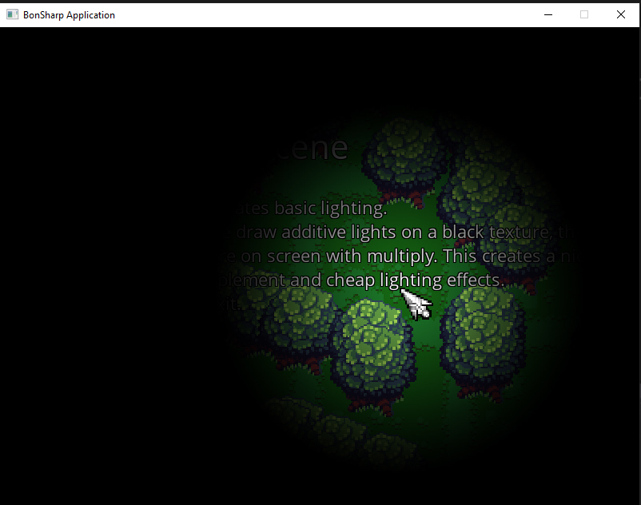

# Lights

This scene implements basic 2d lighting by rendering additive lights onto a render target. It works like this:

1. We create an empty texture in the size of the screen we render to.
2. Every frame we clear that texture into black color.
3. We then render lights on it using *additive blending*. This will make areas affected by lights brighter.
4. At the end, we render this texture at the top of the screen with *multiply blending*. This will make dark areas black and lit areas tinted to the color of the light at this position.



```cs
using System;
using BonEngineSharp.Defs;
using BonEngineSharp.Assets;
using System.Collections.Generic;
using BonEngineSharp.Framework;


/// <summary>
/// Show basic lights scene.
/// </summary>
class BasicLightsScene : BonEngineSharp.Scene
{
    // lights map and single light texture
    private ImageAsset _lightsMapTexture;
    private ImageAsset _lightImage;

    // window size
    PointI _windowSize;
    
    /// <summary>
    /// On scene load.
    /// </summary>
    protected override void Load()
    {
        // load engine config
        Game.LoadConfig("config.ini");

        // load assets
        _lightImage = Assets.LoadImage("gfx/light.png", ImageFilterMode.Nearest);

        // get window size
        _windowSize = Gfx.WindowSize;

        // create lights texture
        _lightsMapTexture = Assets.CreateEmptyImage(_windowSize);
    }

    /// <summary>
    /// Do updates.
    /// </summary>
    protected override void Update(double deltaTime)
    {
        // if user click 'exit' action, exit game
        if (Input.Down("exit"))
        {
            Game.Exit();
        }
    }

    /// <summary>
    /// Draw scene.
    /// </summary>
    protected override void Draw()
    {
        // clear screen
        Gfx.ClearScreen(Color.Cornflower);

        // DRAW YOUR ACTUAL SCENE HERE..
        
        // clear lights texture to black
        Gfx.RenderTarget = _lightsMapTexture;
        Gfx.ClearScreen(Color.Black);
        
        // draw a single light at the mouse position
        Gfx.DrawImage(_lightImage, Input.CursorPosition, new PointI(500, 500), BlendModes.Additive, RectangleI.Empty, PointF.Half);
        Gfx.RenderTarget = null;

        // draw lightsmap on screen
        Gfx.DrawImage(_lightsMapTexture, PointF.Zero, BlendModes.Multiply);
    }
}

```